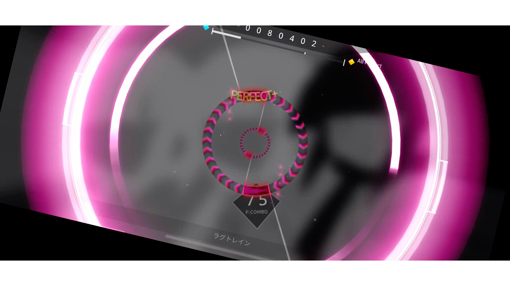

# Python Rotaeno Stabilizer (English README)

*阅读 [中文版](README.md).*



Check out the [video demonstration](https://www.bilibili.com/video/BV1bc411f7fK/?share_source=copy_web&vd_source=9e94008dbf76e399a164028430118348)
This is a Python-based Rotaeno screen recording stabilization script. Its principle is the same as the script provided by Rotaeno for Adobe After Effects, which rotates frames based on the colors of the four corners of the screen recording in live broadcast mode. The goal is to stabilize the video image.

## Features

- No need to install Adobe After Effects; rendering can be done with just one command.
- Supports batch processing of videos.

## Installation

1. Download the project code:
```shell
git clone https://github.com/Lawrenceeeeeeee/python_rotaeno_stabilizer.git
```
Alternatively, you can directly click "Download ZIP" on this repository page, then unzip the downloaded file.

2. Install the dependencies:
```shell
# Navigate to the directory containing the script
cd python_rotaeno_stabilizer
pip install -r requirements.txt
```

3. Install FFmpeg

Please download the appropriate installation package from the [FFmpeg official website](https://ffmpeg.org/download.html).


## How to Use

0. **Attention!** Before recording, ensure the "Streaming Mode" is activated in Rotaeno settings. Once enabled, the four corners of the screen will display color blocks, which indicate the device's rotation angle.

1. Place the video to be processed in the videos directory (currently only supports mp4).

2. Start the project:
```shell
python main.py
```

3. Once processing is complete, find the rendered videos in the `output` folder.

